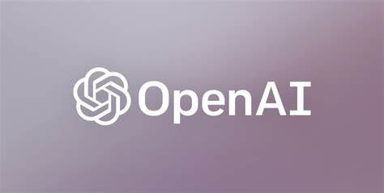

<h1 align="center"> Esenciaai </h1>

<h2>Architecture</h2>

<h2>Database</h2>

Mongodb database hosted in Mongodb Atlas on a serverless cluster, the schema is "Embedded Documetes",
it has one collection for each team with all the information in it.

<pre>
# fields
_id
team_id (str)
daily_survey (dict)
daily_survey_count (int)
retro_count (int)
self_satisfaction_general (int)
team_collaboration_general (int)
work_engagement_general (int)
workspace_general (int)
short_recommendation (dict)
retro (array)
recommendation (dict)
</pre>

<h2>API Rest</h2>
It is a serverless http rest api hosted in gcp, using cloud functions.

[you can find the endpoints here.](api_mongo/cloud_functions_endpoints.md)

<h2>Tech Stack</h2>

<h3>Data</h3>

 &nbsp Google Cloud

 &nbsp MongoDB

 &nbsp OpenIA

<h3>BackEnd</h3>

<h3>FrontEnd</h3>

